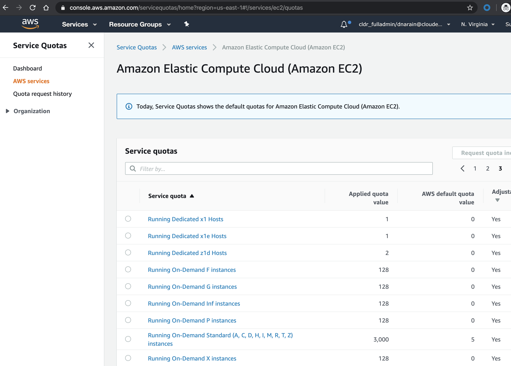

# Preparing Your AWS Account for CDP Public Cloud

Before you can begin the on-boarding, you should prep the your AWS account with 
the following:

* _Adjust EC2 Service Quota_:  A new account AWS account defaults to small EC2 
quota which isn’t enough to finish an onboarding.   You need to increase “Running 
On-Demand  Standard (A, C, D, H, I, M, R, T, Z) Instances” to 256. 

    BTW, that’s 256 vCPUs - not instances.  No, we wont be provisioning 256 vCPUs, 
this just gives us plenty of headroom should we need to scale up our environment.

    If you'd prefer to use the CLI to do this, the commands are:

    ```
    aws service-quotas get-service-quota     --service-code ec2     --quota-code L-1216C47A
    aws service-quotas request-service-quota-increase     --service-code ec2     --quota-code L-1216C47A --desired-value 256
    ```

    Alternatively, you view this from the management console and request a quota 
    increase
    

* _Create Networking_: For private IPs to work seamlessly throughout the product, 
you need the following networking setup. If you'd prefer to automate the creation,
you can use (use [this Terraform configuration](https://github.com/dnarain/cdp-aws)):

    * A VPC with a /16 CIDR range and an egress gateway
    * 3 Public and 3 Private Subnets in 3 different Availability Zones
    * Each Public Subnet must have a route to the VPC Egress and a NAT Gateway
    * Each Private Subnet must have a default route to its corresponding public subnet

    Note: You also need to make sure that you can access the privagte subnets 
    from outside (e.g. your laptop).  A few common approaches to do to this include:
    * Setting up a bastion host in one of the public subnets and using a ssh proxy
    on your computer (e.g. 
    [this one](https://apps.apple.com/ae/app/ssh-proxy/id597790822?mt=12) on MacOS)
    * Installing a proxy server on the bastion host 
    ([like this](https://devopscube.com/setup-and-configure-proxy-server/))
    * Setting up a Windows Jumphost in a public subnet and connecting to it via RDP
    * **NOTE**: If this is an existing "corporate" VPC, there may be a VPN gateway 
    already attached that allows this access

* _Create Storage_: You just need a S3 bucket with default encryption (aka AES-256)
and a folder called logs created within this bucket. 
You can do this manually, or automate it using [this terraform](https://github.com/dnarain/cdp-aws). 

*_Create IAM_: CDP requires a specific IAM setup, you can choose to:

    * Follow the documentation: this is comprehensive, but requires a lot of
    copy-paste, which has been proven to be prone to error
    * Follow a guided approach by using 
    [this Google Sheets spreadsheet - accessible to Cloudera employees only](https://docs.google.com/spreadsheets/d/1IoKywFvyOPHZ9cHknhYF9qzLt65R-d4mKKtzc4T7QYw/edit?usp=sharing)
    * Automate it by using [this terraform](https://github.com/dnarain/cdp-aws)


