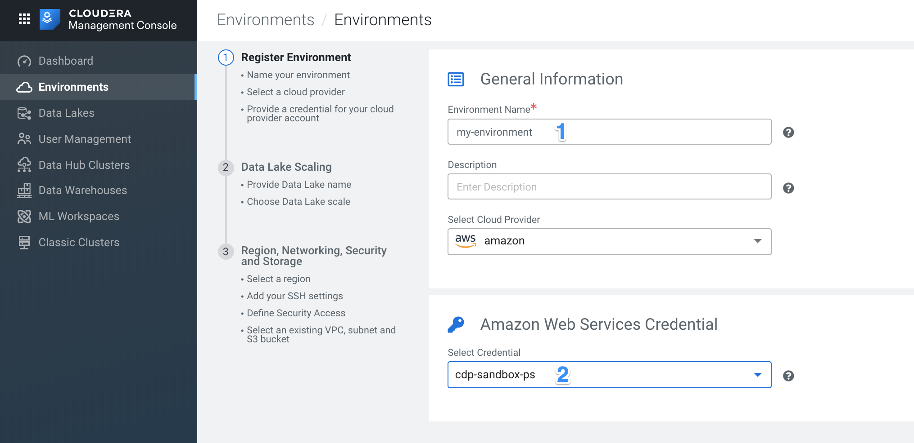
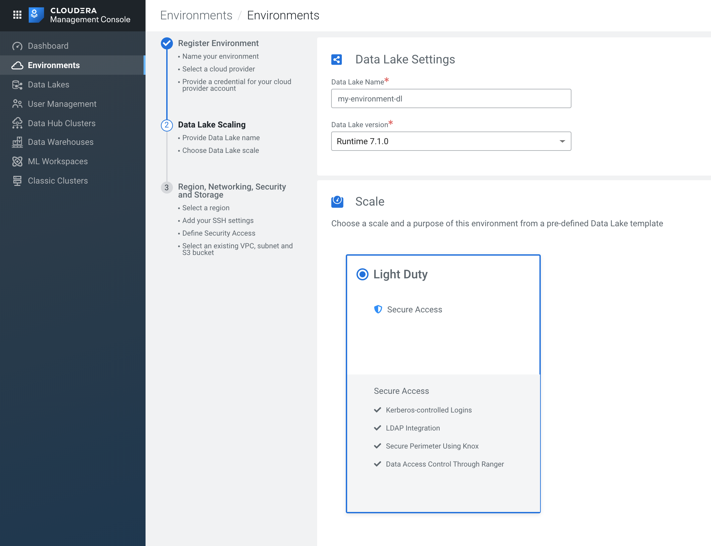
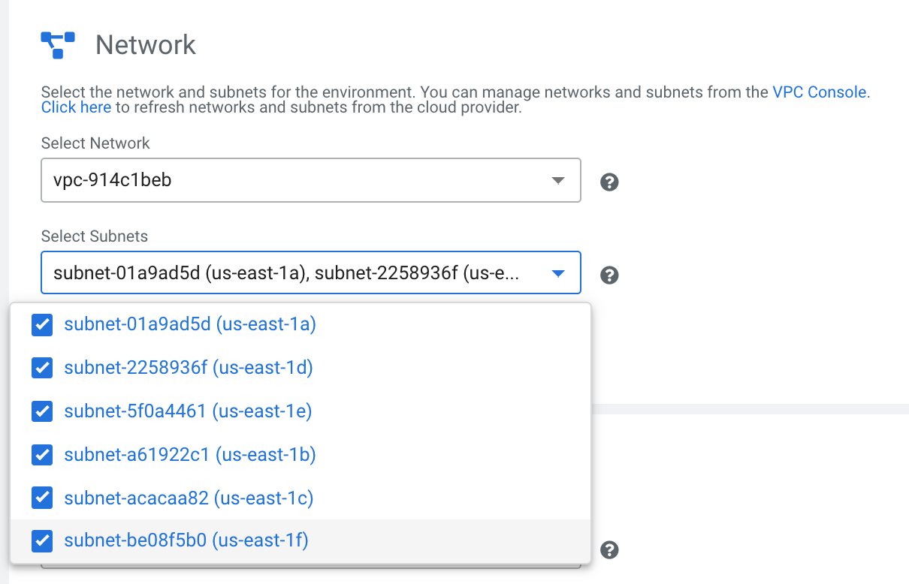
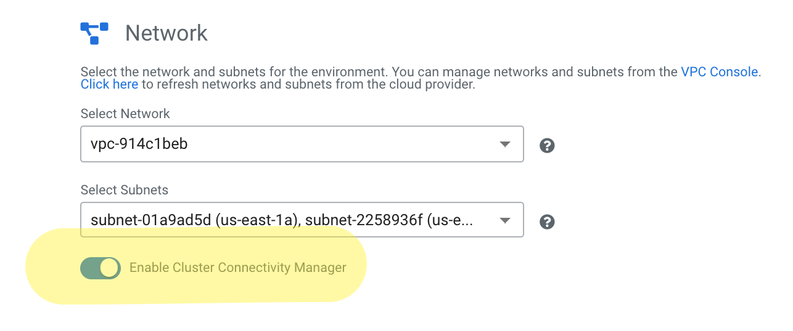
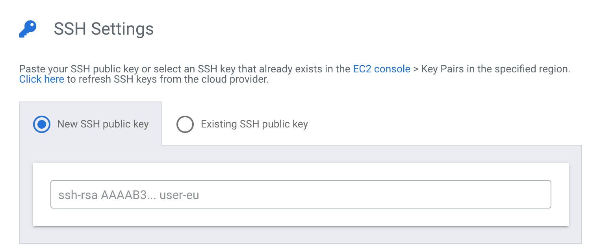
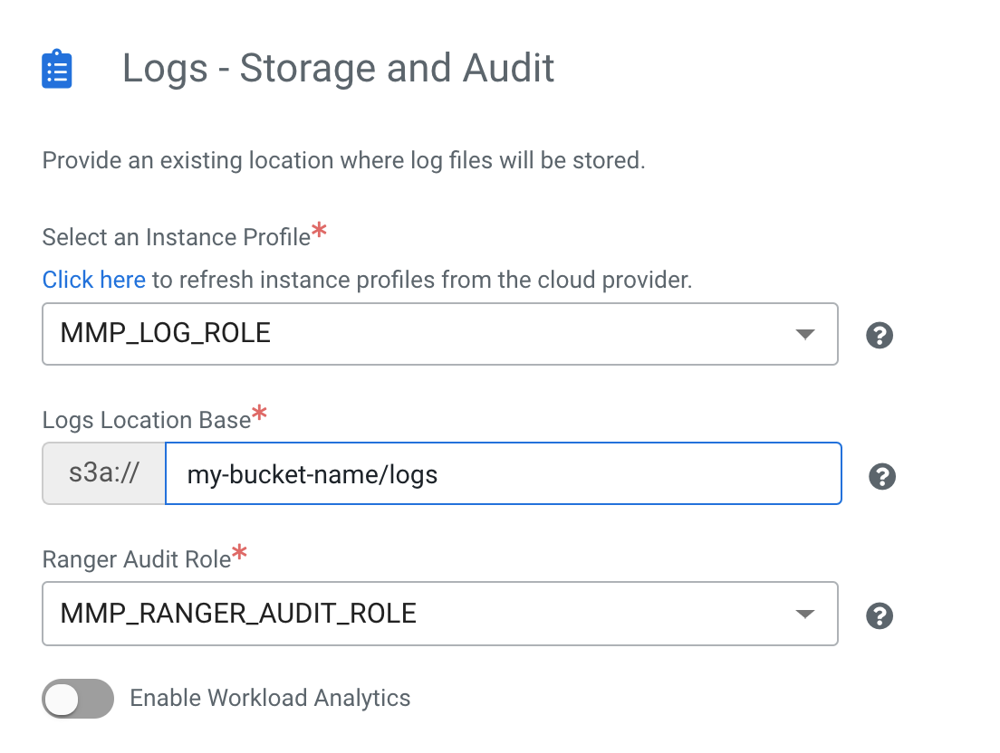
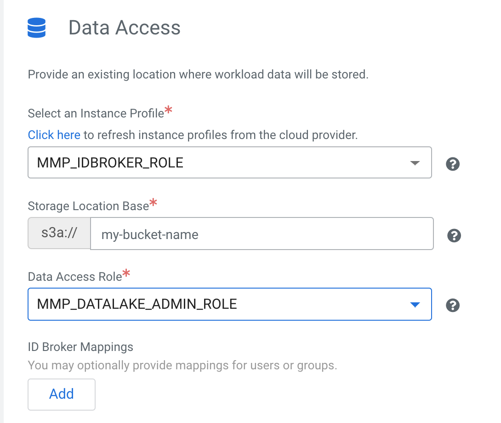
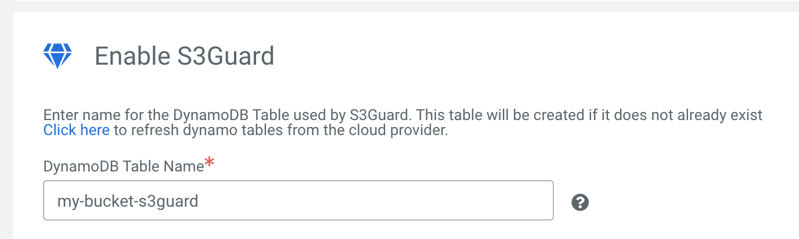
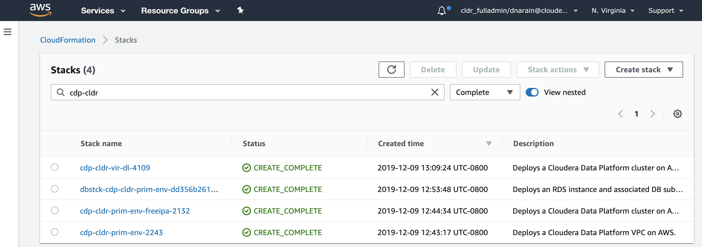

# Set up the CDP Environment

1. To set up a new environment, go to the Management Console section of the CDP UI and click on Environments.  Click Register Environment

## Page 1
1. Give your environment a name, choose the CDP Credential you created in the previous step 

## Page 2
1. Give the datalake a name - you can reuse the name of the environment here if you’d like or give it a unique name 

## Page 3
You are presented with a screen where you choose all the resources that you had set up in previous steps.  It is very important to get everything right as an error here could mean lots of time lost in debugging

1. Choose the region you’ve set up your VPC and S3 buckets in
2. Choose the network you created earlier and choose all 6 subnets 

3. Enable the Cluster Connectivity Manager so that you can use Private IPs

4. Leave the Security Access Type to the default “Create New Security Groups.  The CIDR you specify here is the IPs that are allowed to access the environment via the UI or ssh.  Its best to leave this as the default 0.0.0.0/0, unless you are going to access the environment from a specific network all the time.    
5. Choose your ssh key - you can choose a pre-created PEM File, or just enter the ssh public key manually   
6. Please use care when selecting options in this group; making the wrong choice here may mean you lose a lot of time in debugging the problem
    * For Instance Profile, use the LOGS role that was created earlier (there is a fluentd daemon running on each instance that dumps logs into the logs folder in the S3 bucket, which this role has write access to)
    * The IAM roles & policies set up earlier are configured to write to the logs folder, so please make sure you specify that here
    * For Ranger Audit Role, please choose the appropriate role created earlier - the ranger audit role can only write to the logs/ranger/audit folder, which this role has write access to)
        
7. As before, please use care when selecting options in this group to avoid lost time later on in the process
    * For Instance Profile, choose the IDBroker Role you had set up earlier (it has the privileges to run AssumeRole and the other roles have trusts to it etc.)
    * For Storage Location Base, use the name of the bucket (the IAM roles and policies set up earlier are configured to work this way)
    * For Data Access Role, choose the Datalake Admin Role (this is the role that will be used to write to the datalake)
    * You don’t need add any additional ID Broker Mappings at this point - this is an advanced option for users who want to segregate their environment further, or use multiple S3 buckets.
    
    
8. CDP uses DynamoDB for S3Guard - which is used by the S3A client to ensure consistency in S3.  If you used the spreadsheet or Terraform configurations to set up the IAM roles, then you can use any name here that meets the regex bucketname-*
    NOTE: Do not use a table name that already exists, the environment will not provision if you do.  You can use the “Click Here” link to load up the existing DynamoDB tables if you want to check 

    

9. Click on Register Environment and wait for the environment to get created. This process takes some time, so please be patient.

# What’s Happening Behind the Scenes

While the environment creation process takes a substantial amount of time, it is possible to follow the process from AWS to know what is happening behind the scenes.  To do this, you need to open up the CloudFormation console and follow the environment creation process.  

This screenshot is from a completed environment (cdp-cldir-prim-env) and its datalake (cdp-cldr-vir-dl):

* cdp-cldr-prim-env-<####>: This is the networking stack that creates the VPC and subnets (not relevant in this case as they have been manually created

* cdp-cldir-prim-env-freeipa-<####>: Create the security group and configs for the FreeIPA instance.  Following this the FreeIPA instance will be created in EC2

* dbstck-cdp-cldr-prim-env-<uuid>: The RDS instance that will be used as the persistent store for HMS and other services in the datalake 

* cdp-cldir-vir-dl-<####>:  Create the security group and configs for the Master and IDBroker instances.  Following this the instances will be created in EC2

# Debugging Datalake Startup Issues

In the event that something went wrong, you can debug it using the steps in [this presentation](https://docs.google.com/presentation/d/1bDTY01nGrHrqASVHK0_BeYO2ixXadIbjI8V3-lCwIxI/edit?usp=sharing) (NOTE: link only accessible by Cloudera Employees)

