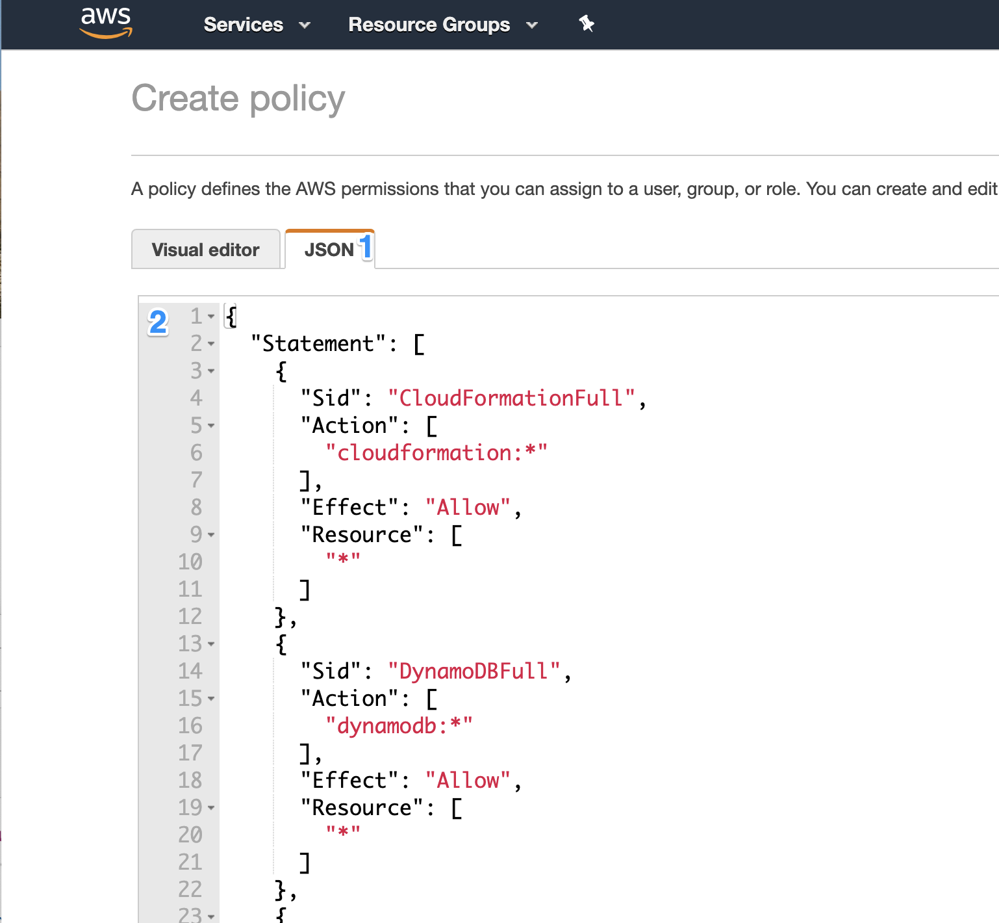

# Create a CDP Credential

The CDP Credential maps to a Cross-Account-Role in AWS.  A Cross-Account-Role is 
how you give a third party account (in this case, the CDP Control Plane account) 
privileges to launch resources into your AWS account. 

1. In one browser tab, navigate to the Credentials list and click on Create Credential

2. Copy the Cross Account Policy by clicking the Copy icon next to it 

3. In another tab, open up AWS and navigate to the Create Policy in IAM

4. Click on the JSON tab and paste this policy here

5. Click Review Policy, name the Policy and Create It

6. Next, we create the Cross Account Role - Navigate to Roles and Create Role

7. Select “Another AWS Account” as the trusted entity, also select “Require 
external ID”.  Copy and paste the Service Manager Account ID and External ID from CDP here:

8. Click on Permissions and attach the Policy that you just created here

9. Click through, name the role and save it

10. Now, go back and find this role to get its ARN (Amazon Resource Name) and paste it into CDP

11. Name your CDP credential and hit Create.

