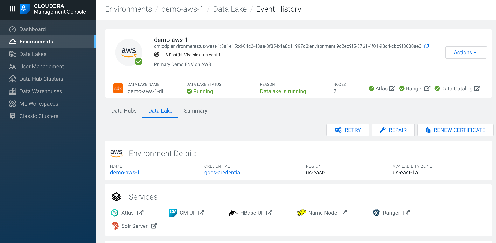
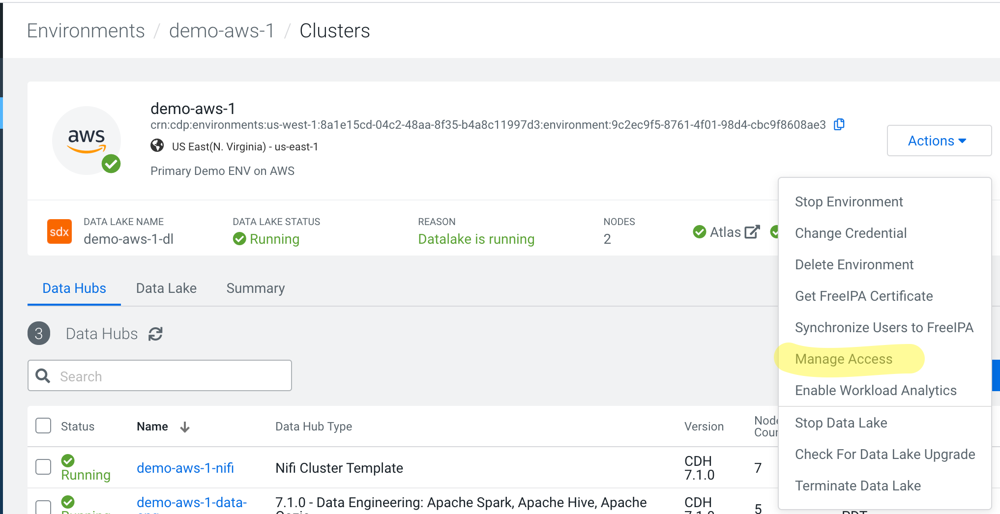
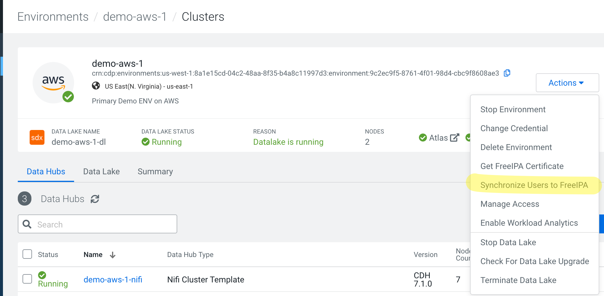
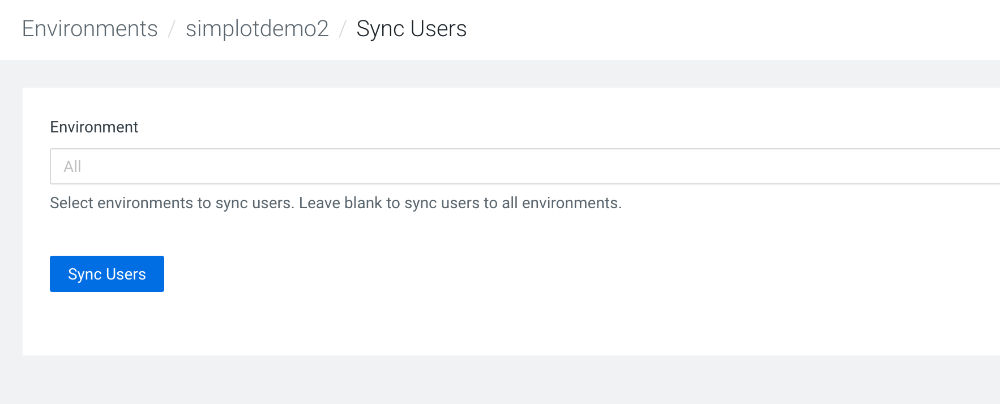

# Access the Datalake(via SSO)
Once your environment is set up, you should see a screen like this:

Clicking on the Datalake tab will allow you to access the various services in the datalake

# 403s Everywhere
However, when you first try to access any service in the datalake, you will be greeted with this error (in this screenshot, I am trying to access the Cloudera Manager in the Datalake)

This happens because you haven't authorized any users for this specific environment.  Authorizing a user is a two step process:
1. Assign the right roles to the user using the Management Console
2. Sync the changes down to the Environment you just created

The below steps will show you how to authorize a single user, but you can do the same for a group and simply add users to that group.

# Assign Roles and Syc

1. Go to the Actions pulldown for the environment in the Management Console and
select Manage Access

2. You should see a screen with no users

3. Find your user using the search box and assign it the right roles.  CDP supports
a granular level of access and the two roles you need at this point are:
* EnvironmentUser
* EnvironmentAdmin

[I recommend enabling the all at this point to avoid coming back here each time you
enable a new service]

4. All the changes made via the Management Console are captured in the control 
plane.  To make these changes effective, you have to Synchronize Users to FreeIPA.  

This is done from the same Actions pulldown.  

Click through and start the sync.

It takes a few minutes for the sync to finish

4. Voila, you're in. Now, when you retry accessing the URLs for Datalake service, you should be single
signed on to it.

